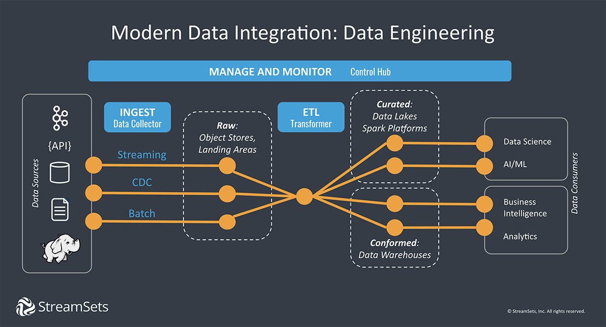

### Data Engineering and Big Data

**Data Engineers Deliver:**
* The correct data
* In the right form
* To the right people
* As efficiently as possible

**The Five V's of Big Data:**
* Volume (the quantity of data points )
* Variety (type and nature of data)
* Velocity (how fast the data is generated and processed)
* Veracity (how trustworthy the sources are)
* Value (how actionable the data is)

**Data Engineer VS Data Scientist:**
Data Engineer | Data Scientist
------------ | -------------
Ingest and Store Data | Exploit Data
Setup databases | Access databases
Build data pipelines | Use pipelines outputs
Strong software skills | Strong analytical skills

**Data Pipelines:**

 A data pipeline is the series of steps required to make data from one system useful in another. The steps might include ingesting, transforming, processing, publishing or moving data. 

Things that must be considered:
**Automate:**
* Extracting
* Transforming
* Combining
* Validating
* Loading

**Reduce**
* Human intervention
* Errors
* The time it takes to flow

**ELT**
* Extract
* Transform
* Load

**some points about piplines:**
* Move data from one system to another
* May or may not follow ETL
* Data may not be transformed
* May be directly loaded