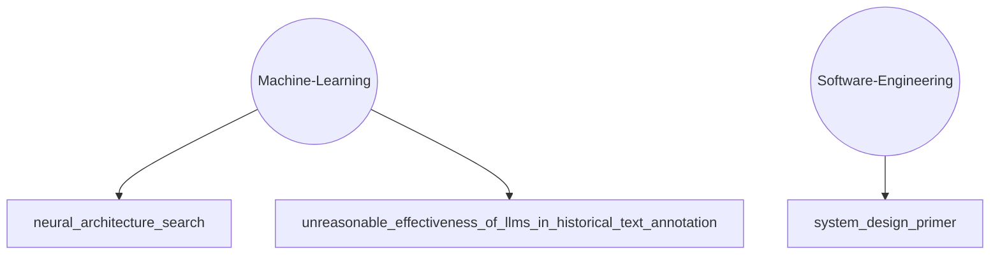

# TLDR Knowledge Base

## Knowledge Graph

## All Knowledge
### Machine-Learning
- [Neural Architecture Search](knowledge/Machine-Learning/neural-architecture-search.md)
- [Unreasonable Effectiveness Of Llms In Historical Text Annotation](knowledge/Machine-Learning/unreasonable-effectiveness-of-llms-in-historical-text-annotation.md)

### Software-Engineering
- [System Design Primer](knowledge/Software-Engineering/system-design-primer.md)

