# TLDR

Sharing back what I'm learning with the community—curated insights, practical knowledge, and key resources from my ongoing journey in tech, data, and beyond.

<!-- TLDR-AUTO-START -->
## Overview

```mermaid
graph TD
    Machine-Learning(( Machine-Learning ))
    Machine-Learning --> neurosym_biocat_biomedical_document_categorization
    Machine-Learning --> evaluation_is_all_you_need_strategic_overclaiming_llm_capabilities
    Machine-Learning --> tracing_thoughts_language_model
    Machine-Learning --> llm_evaluation_metrics_everything_you_need
    Machine-Learning --> neural_architecture_search
    Machine-Learning --> inside_nvidia_gpus_high_performance_matmul_kernels
    Machine-Learning --> survey_of_context_engineering_for_llms
    Software-Engineering(( Software-Engineering ))
    Software-Engineering --> levels_of_testing_quality_assurance
    Software-Engineering --> technical_debt
    Software-Engineering --> how_to_refactor
    Software-Engineering --> when_to_refactor
    Software-Engineering --> system_design_primer
    Software-Engineering --> what_is_rdf
    Software-Engineering --> software_testing_life_cycle_stlc
    Software-Engineering --> software_testing_process_methods_and_stages
    Information-Science(( Information-Science ))
    Information-Science --> what_is_an_ontology
    Information-Science --> ontology_in_information_science
    Information-Science --> seven_security_considerations_cloud_laboratory_analytics
    Information-Science --> what_is_rdf
    Information-Science --> rdf_1_1_concepts_and_abstract_syntax
```

## Read the summaries
### Machine-Learning
- [Neurosym Biocat Biomedical Document Categorization](knowledge/Machine-Learning/neurosym-biocat-biomedical-document-categorization.md)
- [Evaluation Is All You Need Strategic Overclaiming Llm Capabilities](knowledge/Machine-Learning/evaluation-is-all-you-need-strategic-overclaiming-llm-capabilities.md)
- [Tracing Thoughts Language Model](knowledge/Machine-Learning/tracing-thoughts-language-model.md)
- [Llm Evaluation Metrics Everything You Need](knowledge/Machine-Learning/llm-evaluation-metrics-everything-you-need.md)
- [Neural Architecture Search](knowledge/Machine-Learning/neural-architecture-search.md)
- [Inside Nvidia Gpus High Performance Matmul Kernels](knowledge/Machine-Learning/inside-nvidia-gpus-high-performance-matmul-kernels.md)
- [Survey Of Context Engineering For Llms](knowledge/Machine-Learning/survey-of-context-engineering-for-llms.md)

### Software-Engineering
- [Levels Of Testing Quality Assurance](knowledge/Software-Engineering/levels-of-testing-quality-assurance.md)
- [Technical Debt](knowledge/Software-Engineering/technical-debt.md)
- [How To Refactor](knowledge/Software-Engineering/how-to-refactor.md)
- [When To Refactor](knowledge/Software-Engineering/when-to-refactor.md)
- [System Design Primer](knowledge/Software-Engineering/system-design-primer.md)
- [What Is Rdf](knowledge/Software-Engineering/what-is-rdf.md)
- [Software Testing Life Cycle Stlc](knowledge/Software-Engineering/software-testing-life-cycle-stlc.md)
- [Software Testing Process Methods And Stages](knowledge/Software-Engineering/software-testing-process-methods-and-stages.md)

### Information-Science
- [What Is An Ontology](knowledge/Information-Science/what-is-an-ontology.md)
- [Ontology In Information Science](knowledge/Information-Science/ontology-in-information-science.md)
- [Seven Security Considerations Cloud Laboratory Analytics](knowledge/Information-Science/seven-security-considerations-cloud-laboratory-analytics.md)
- [What Is Rdf](knowledge/Information-Science/what-is-rdf.md)
- [Rdf 1 1 Concepts And Abstract Syntax](knowledge/Information-Science/rdf-1-1-concepts-and-abstract-syntax.md)

<!-- TLDR-AUTO-END -->

