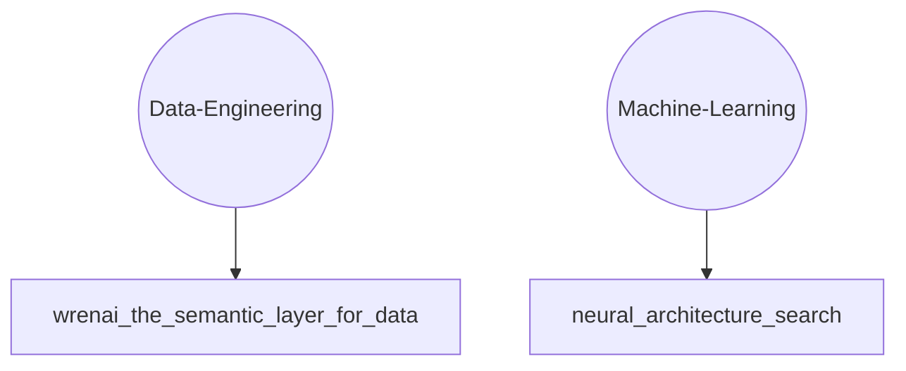

# TLDR Knowledge Base

## Knowledge Graph

## All Knowledge
### Data-Engineering
- [Wrenai The Semantic Layer For Data](knowledge/Data-Engineering/wrenai-the-semantic-layer-for-data.md)

### Machine-Learning
- [Neural Architecture Search](knowledge/Machine-Learning/neural-architecture-search.md)

