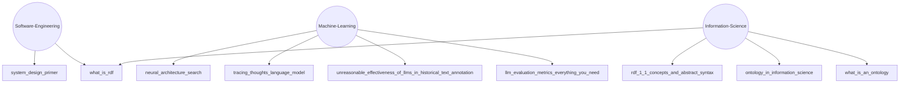

# TLDR

Sharing back what I'm learning with the community—curated insights, practical knowledge, and key resources from my ongoing journey in tech, data, and beyond.

<!-- TLDR-AUTO-START -->
## Overview

## Read the summaries
### Software-Engineering
- [System Design Primer](knowledge/Software-Engineering/system-design-primer.md)
- [What Is Rdf](knowledge/Software-Engineering/what-is-rdf.md)

### Machine-Learning
- [Neural Architecture Search](knowledge/Machine-Learning/neural-architecture-search.md)
- [Tracing Thoughts Language Model](knowledge/Machine-Learning/tracing-thoughts-language-model.md)
- [Unreasonable Effectiveness Of Llms In Historical Text Annotation](knowledge/Machine-Learning/unreasonable-effectiveness-of-llms-in-historical-text-annotation.md)
- [Llm Evaluation Metrics Everything You Need](knowledge/Machine-Learning/llm-evaluation-metrics-everything-you-need.md)

### Information-Science
- [Rdf 1 1 Concepts And Abstract Syntax](knowledge/Information-Science/rdf-1-1-concepts-and-abstract-syntax.md)
- [Ontology In Information Science](knowledge/Information-Science/ontology-in-information-science.md)
- [What Is An Ontology](knowledge/Information-Science/what-is-an-ontology.md)
- [What Is Rdf](knowledge/Information-Science/what-is-rdf.md)

<!-- TLDR-AUTO-END -->

